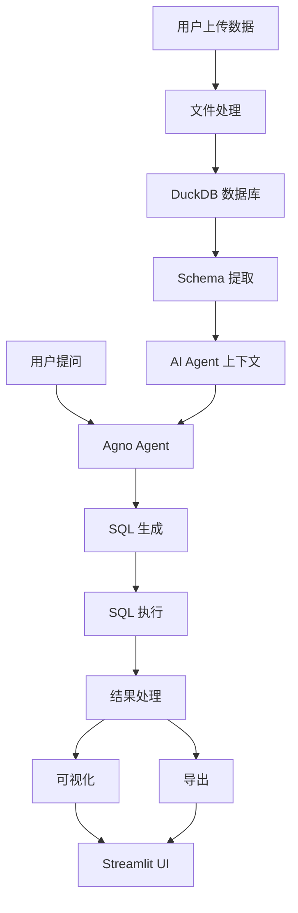

# AI 数据分析 Agent（Agno + DeepSeek + DuckDB）

<div align="center">


**一个基于 AI 的数据分析工具，支持使用自然语言直接分析数据。**

[功能特性](#-功能特性) • [安装](#-安装) • [使用方式](#-使用方式) • [系统架构](#-系统架构) • [示例](#-示例)

</div>

---

## ✨ 功能特性

### 📤 文件上传支持

* **多种格式**：CSV、Excel（XLS/XLSX）、Parquet、JSON
* **自动表结构识别**：智能推断字段类型
* **大文件支持**：基于 DuckDB 的高效内存管理
* **批量处理**：支持同时上传和分析多个文件

---

### 💬 自然语言查询

* **AI 自动生成 SQL**：将自然语言转换为高效的 DuckDB SQL
* **无需 SQL 基础**：直接提问，如“按销售额排名前 10 的客户”
* **上下文感知**：AI 理解数据表结构和字段含义
* **查询校验**：自动检查 SQL 语法与安全性

---

### 🔍 高级数据分析

* **统计汇总**：描述性统计、分布分析、相关性分析
* **数据聚合**：Group By、透视表、窗口函数、CTE
* **筛选与排序**：支持复杂条件和多字段排序
* **模式识别**：发现趋势、异常值和离群点

---

### 📊 交互式可视化

* **多种图表类型**：折线图、柱状图、散点图、面积图、直方图、箱线图
* **实时更新**：查询结果变化时图表自动更新
* **智能推荐**：AI 推荐合适的可视化方式
* **导出支持**：保存为图片或交互式 HTML

---

### 🎯 友好的用户界面

* **Streamlit 仪表盘**：简洁、现代、响应式 UI
* **侧边栏控制**：快速查看设置和表信息
* **查询历史**：记录并重跑历史分析
* **结果导出**：支持 CSV、Excel、JSON、Parquet

---

## 🚀 快速开始

### 环境要求

* Python 3.10 或以上
* DeepSeek API Key（可在 [https://platform.deepseek.com](https://platform.deepseek.com) 免费申请）

---

### 📦 安装步骤

#### 1️⃣ 克隆项目并创建虚拟环境

```bash
git clone https://github.com/yourusername/ai-data-analysis-agent.git
cd ai-data-analysis-agent

python -m venv .venv

# Windows
.venv\Scripts\activate

# Linux / macOS
source .venv/bin/activate
```

---

#### 2️⃣ 安装依赖

```bash
pip install -r requirements.txt
```

---

#### 3️⃣ 配置 API Key

```bash
# 复制环境变量示例文件
copy .env.example .env
```

在 `.env` 文件中填写：

```env
DEEPSEEK_API_KEY=你的_api_key
```

或直接设置环境变量：

```bash
# Windows
setx DEEPSEEK_API_KEY "your_api_key_here"

# Linux / macOS
export DEEPSEEK_API_KEY="your_api_key_here"
```

---

### ▶️ 启动应用

```bash
# 基础版本
streamlit run app.py

# 增强版本（推荐）
streamlit run app_enhanced.py
```

---

## 📖 使用方式

### 1️⃣ 上传数据

* 点击「Upload Data Files」
* 选择 CSV / Excel / Parquet / JSON 文件
* 查看自动识别的表结构和数据预览

---

### 2️⃣ 使用自然语言提问

示例问题：

* “销售额最高的前 5 个产品？”
* “每月收入趋势如何？”
* “不同地区的平均销售额对比”
* “找出消费金额超过 1000 的客户”

---

### 3️⃣ 分析结果

* 查看 AI 生成的 SQL
* 浏览查询结果表格
* 查看统计分析
* 生成可视化图表

---

### 4️⃣ 导出与分享

* 导出 CSV / Excel / JSON / Parquet
* 保存查询历史
* 分享分析结果

---

## 🏗️ 系统架构



---

### 核心模块说明

1. **`agent_core.py`**：基础 AI Agent
2. **`agent_enhanced.py`**：增强版 Agent（校验 + 分析）
3. **`duckdb_manager.py`**：DuckDB 数据管理
4. **`app.py`**：基础 Streamlit 应用
5. **`app_enhanced.py`**：完整功能 UI

---

## 📊 示例问题

| 类型 | 示例问题          | 生成 SQL                                           |
| -- | ------------- | ------------------------------------------------ |
| 聚合 | 每月销售总额        | `SELECT strftime(date, '%Y-%m'), SUM(sales) ...` |
| 筛选 | 纽约客户且消费 > 500 | `WHERE city='New York' AND total_purchases>500`  |
| 排名 | 销售额前 10 产品    | `ORDER BY total_revenue DESC LIMIT 10`           |
| 趋势 | 2024 年月度销售趋势  | `DATE_TRUNC('month', order_date)`                |
| 对比 | 不同客户等级的客单价    | `GROUP BY segment`                               |

---

## 🔧 配置说明

### `.env` 配置项

```env
DEEPSEEK_API_KEY=你的key

APP_TITLE="AI 数据分析 Agent"
APP_DEBUG=false
DEFAULT_ROW_LIMIT=200
MAX_ROW_LIMIT=10000
DUCKDB_MEMORY_LIMIT=2GB
ENABLE_ADVANCED_VISUALIZATIONS=true
```

---

## 📈 性能建议

* **大数据量**：优先使用 Parquet
* **复杂分析**：使用增强 Agent
* **可视化**：控制点数量，避免过密

---

## 🛠 常见问题排查

### 1️⃣ 找不到 openai / duckdb

```bash
pip install openai duckdb
```

### 2️⃣ Windows 权限问题

推荐使用虚拟环境 `.venv`

### 3️⃣ Streamlit 启动异常

```bash
streamlit run app.py --server.port 8502
```

### 4️⃣ DeepSeek / Agno 报错

```bash
pip install agno openai
```

---

## 📄 许可证

MIT License

---

## 🙏 致谢

* Agno
* DeepSeek
* DuckDB
* Streamlit

---

如果你愿意，我还能帮你做这几件事之一👇

* ✨ **再压缩成“公司内部版 README”**
* 📦 **写一份中文使用说明（给非技术同事）**
* 🧱 **把 README 和你现在代码结构对齐（修不一致点）**

你选一个，我直接给你成品。
