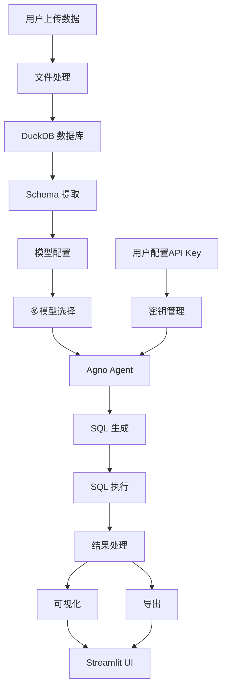

# AI 数据分析 Agent（Agno + 多模型 + DuckDB）

<div align="center">


**一个基于 AI 的数据分析工具，支持使用自然语言直接分析数据。**

[功能特性](#-功能特性) • [安装](#-安装) • [使用方式](#-使用方式) • [模型配置](#-模型配置) • [系统架构](#-系统架构) • [示例](#-示例)

</div>

---

## ✨ 功能特性

### 🤖 多模型支持

- **DeepSeek**：deepseek-chat、deepseek-reasoner
- **智谱(ChatGLM)**：glm-4、glm-4-plus、glm-3-turbo
- **豆包(Doubao)**：doubao-pro-32k、doubao-pro-128k
- **千问(Qwen)**：qwen-turbo、qwen-plus、qwen-max
- **OpenAI**：gpt-4o、gpt-4o-mini

### 📤 文件上传支持

- **多种格式**：CSV、Excel（XLS/XLSX）、Parquet、JSON
- **自动表结构识别**：智能推断字段类型
- **大文件支持**：基于 DuckDB 的高效内存管理
- **批量处理**：支持同时上传和分析多个文件

### 💬 自然语言查询

- **AI 自动生成 SQL**：将自然语言转换为高效的 DuckDB SQL
- **无需 SQL 基础**：直接提问，如"按销售额排名前 10 的客户"
- **上下文感知**：AI 理解数据表结构和字段含义
- **查询校验**：自动检查 SQL 语法与安全性

### � 灵活的密钥配置

- **环境变量配置**：支持通过 .env 文件或系统环境变量配置 API Key
- **页面实时配置**：可在 Web 界面中直接输入 API Key
- **多模型密钥管理**：不同模型使用不同的 API Key，互不干扰
- **智能密钥加载**：优先使用页面配置，其次使用环境变量

---

## 🚀 快速开始

### 环境要求

- Python 3.10 或以上
- 至少一个模型提供商的 API Key

---

### 📦 安装步骤

#### 1️⃣ 克隆项目并创建虚拟环境

```bash
git clone https://github.com/yourusername/ai-data-analysis-agent.git
cd ai-data-analysis-agent

python -m venv .venv

# Windows
.venv\Scripts\activate

# Linux / macOS
source .venv/bin/activate
```

---

#### 2️⃣ 安装依赖

```bash
pip install -r requirements.txt
```

---

#### 3️⃣ 配置 API Key（两种方式）

**方式一：使用 .env 文件（推荐）**

```bash
# 复制环境变量示例文件
copy .env.example .env  # Windows
cp .env.example .env    # Linux / macOS
```

在 `.env` 文件中填写您要使用的模型 API Key：

```env
# DeepSeek (默认)
DEEPSEEK_API_KEY=your_deepseek_api_key

# 智谱(ChatGLM)
ZHIPU_API_KEY=your_zhipu_api_key

# 豆包(Doubao)
DOUBAO_API_KEY=your_doubao_api_key

# 千问(Qwen)
QWEN_API_KEY=your_qwen_api_key

# OpenAI (可选)
OPENAI_API_KEY=your_openai_api_key
```

**方式二：使用环境变量**

```bash
# Windows
setx DEEPSEEK_API_KEY "your_api_key_here"

# Linux / macOS
export DEEPSEEK_API_KEY="your_api_key_here"
```

**方式三：页面配置（无需修改文件）**

启动应用后，在侧边栏直接输入 API Key，详见[使用方式](#-使用方式)。

---

#### 4️⃣ 模型 API Key 获取地址

| 提供商 | 注册地址 | 说明 |
|--------|----------|------|
| DeepSeek | https://platform.deepseek.com/ | 新用户免费额度充足 |
| 智谱(ChatGLM) | https://open.bigmodel.cn/dev/howuse/introduction | 注册送 Tokens |
| 豆包(Doubao) | https://www.volcengine.com/product/doubao | 火山引擎平台 |
| 千问(Qwen) | https://dashscope.console.aliyun.com/ | 阿里云通义千问 |
| OpenAI | https://platform.openai.com/ | 需要海外网络 |

---

### ▶️ 启动应用

```bash
# 基础版本
streamlit run app.py

# 增强版本（推荐，功能更完整）
streamlit run app_enhanced.py
```

---

## 📖 使用方式

### 1️⃣ 选择模型并配置 API Key

启动应用后，在左侧边栏进行配置：

1. **选择模型**：从下拉菜单中选择要使用的 AI 模型
2. **输入 API Key**：
   - 如果已配置环境变量，会自动加载
   - 也可以直接在页面输入框中粘贴 API Key
3. 点击按钮确认配置

### 2️⃣ 上传数据

- 点击「上传数据文件」
- 选择 CSV / Excel / Parquet / JSON 文件
- 查看自动识别的表结构和数据预览

### 3️⃣ 使用自然语言提问

示例问题：

- "销售额最高的前 5 个产品？"
- "每月收入趋势如何？"
- "不同地区的平均销售额对比"
- "找出消费金额超过 1000 的客户"

### 4️⃣ 分析结果

- 查看 AI 生成的 SQL
- 浏览查询结果表格
- 查看统计分析
- 生成可视化图表

### 5️⃣ 导出与分享

- 导出 CSV / Excel / JSON / Parquet
- 保存查询历史
- 分享分析结果

---

## 📦 模型配置

### 可用模型列表

| 提供商 | 模型名称 | 上下文长度 | 推荐场景 |
|--------|----------|------------|----------|
| DeepSeek | deepseek-chat | 64K | 通用分析（默认） |
| DeepSeek | deepseek-reasoner | 64K | 复杂推理 |
| 智谱 | glm-4 | 128K | 长文本分析 |
| 智谱 | glm-4-plus | 128K | 高精度任务 |
| 智谱 | glm-3-turbo | 128K | 快速响应 |
| 豆包 | doubao-pro-32k | 32K | 日常分析 |
| 豆包 | doubao-pro-128k | 128K | 大数据集 |
| 千问 | qwen-turbo | 8K | 快速分析 |
| 千问 | qwen-plus | 32K | 通用场景 |
| 千问 | qwen-max | 64K | 高质量输出 |
| OpenAI | gpt-4o | 128K | 通用场景 |
| OpenAI | gpt-4o-mini | 128K | 成本敏感 |

### 推荐模型

**免费/低成本首选**：
- DeepSeek Chat（性价比最高）
- 智谱 GLM-3-Turbo（免费额度多）
- 豆包 Doubao Pro 32K
- 千问 Qwen Turbo

**高质量输出**：
- DeepSeek Reasoner
- 智谱 GLM-4
- 千问 Qwen Max
- OpenAI GPT-4o

---

## 🔧 配置说明

### `.env` 完整配置项

```env
# =====================
# API Keys (按需配置)
# =====================
DEEPSEEK_API_KEY=your_deepseek_api_key
ZHIPU_API_KEY=your_zhipu_api_key
DOUBAO_API_KEY=your_doubao_api_key
QWEN_API_KEY=your_qwen_api_key
OPENAI_API_KEY=your_openai_api_key

# =====================
# 应用设置
# =====================
APP_TITLE="AI 数据分析 Agent"
APP_DEBUG=false
APP_LOG_LEVEL=INFO

# =====================
# DuckDB 配置
# =====================
DUCKDB_MEMORY_LIMIT=2GB
DUCKDB_THREADS=4
DUCKDB_TEMP_DIRECTORY=./temp

# =====================
# 文件上传设置
# =====================
UPLOAD_MAX_SIZE_MB=100
UPLOAD_ALLOWED_EXTENSIONS=.csv,.xlsx,.xls,.parquet,.json
UPLOAD_TEMP_DIR=./data_uploads

# =====================
# 查询设置
# =====================
DEFAULT_ROW_LIMIT=200
MAX_ROW_LIMIT=10000
QUERY_TIMEOUT_SECONDS=30

# =====================
# 默认模型设置
# =====================
DEFAULT_MODEL=deepseek-chat
MODEL_TEMPERATURE=0.1
MODEL_MAX_TOKENS=1000
```

---

## 🏗️ 系统架构



---

### 核心模块说明

1. **`model_config.py`**：多模型配置管理
2. **`agent_core.py`**：基础 AI Agent
3. **`agent_enhanced.py`**：增强版 Agent（校验 + 分析）
4. **`duckdb_manager.py`**：DuckDB 数据管理
5. **`app.py`**：基础 Streamlit 应用
6. **`app_enhanced.py`**：完整功能 UI

---

## 📊 示例问题

| 类型 | 示例问题 | 生成 SQL |
| -- | ------------- | ------------------------------------------------ |
| 聚合 | 每月销售总额 | `SELECT strftime(date, '%Y-%m'), SUM(sales) ...` |
| 筛选 | 纽约客户且消费 > 500 | `WHERE city='New York' AND total_purchases>500` |
| 排名 | 销售额前 10 产品 | `ORDER BY total_revenue DESC LIMIT 10` |
| 趋势 | 2024 年月度销售趋势 | `DATE_TRUNC('month', order_date)` |
| 对比 | 不同客户等级的客单价 | `GROUP BY segment` |

---

## 📈 性能建议

- **大数据量**：优先使用 Parquet 格式
- **复杂分析**：使用增强 Agent（app_enhanced.py）
- **可视化**：控制点数量，避免过密
- **长文本分析**：选择上下文长度 > 128K 的模型
- **成本控制**：日常分析使用 glm-3-turbo 或 qwen-turbo

---

## 🛠️ 常见问题排查

### 1️⃣ 找不到 openai / duckdb

```bash
pip install openai duckdb
```

### 2️⃣ Windows 权限问题

推荐使用虚拟环境 `.venv`

### 3️⃣ Streamlit 启动异常

```bash
streamlit run app.py --server.port 8502
```

### 4️⃣ API 调用报错

```bash
# 检查 API Key 是否正确
echo %DEEPSEEK_API_KEY%

# 检查模型名称是否正确
# 参考可用模型列表
```

### 5️⃣ 模型不支持错误

确保在 `.env` 中配置了对应模型的 API Key，或在页面中手动输入。

---

## 📄 许可证

MIT License

---

## 🙏 致谢

- [Agno](https://github.com/agno-ai/agno) - AI Agent 框架
- [DeepSeek](https://www.deepseek.com/) - 大语言模型
- [智谱AI](https://www.zhipuai.cn/) - ChatGLM
- [豆包](https://www.doubao.com/) - Doubao
- [阿里云](https://www.aliyun.com/) - 通义千问
- [DuckDB](https://duckdb.org/) - 嵌入式分析数据库
- [Streamlit](https://streamlit.io/) - Web 应用框架
